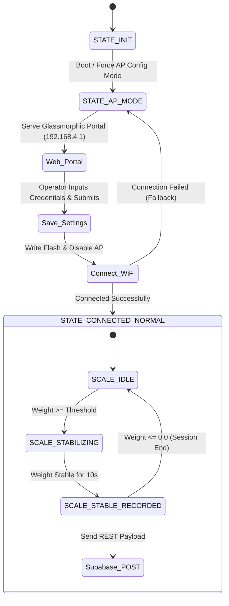

# Gluvok by Lathey Weigh Trix — ESP32 Cloud Weighing System

An enterprise-grade IoT firmware for ESP32 microcontrollers designed to bridge industrial weighing scale indicators with **Cloud Supabase** database logging. Features a modern glassmorphic web configuration portal, non-volatile NVS flash settings, automatic scale weight stabilization detection, Supabase JWT authentication, and automatic over-the-air (OTA) firmware updates.

---

## 🌟 Key Features

- **Styled Glassmorphic Configuration Portal**: Built-in Access Point (AP) mode serving an embedded responsive web UI for setting up Wi-Fi network credentials, operator login details, center IDs, and minimum weight thresholds.
- **Permanent NVS Storage**: Stores configuration parameters securely in ESP32 Non-Volatile Flash (`Preferences` library).
- **Weight Scale Serial Parsing**: Reads raw continuous stream data from UART2 (pins 16/17 at 1200 Baud 8N1) supporting integer and floating-point readings.
- **Weight Stabilization Detection**: Built-in state machine that tracks weight stability over time (`STABILITY_TOLERANCE = 2.0 kg`, `STABILITY_DURATION = 10s`) before triggering cloud upload.
- **Supabase Cloud Integration**: Authenticates via Supabase Auth REST API using operator credentials to obtain dynamic JWT tokens and post weighment logs to the `weighments` database table.
- **Automatic OTA Firmware Update**: Periodically checks remote GitHub JSON release manifest (`version.json`) every hour and flashes new firmware binaries over-the-air using `HTTPUpdate`.
- **Non-Blocking Architecture**: Fully non-blocking main execution loop with auto-reconnection logic for Wi-Fi.

---

## 🛠️ Hardware Requirements & Pinout

### Recommended Microcontroller
- **ESP32 Development Board** (ESP32-WROOM-32 or similar)

### UART2 Serial Indicator Pinout
The ESP32 communicates with the industrial weight scale indicator via HardwareSerial `UART2`:

| ESP32 Pin | Function | Scale Indicator Connection |
| :--- | :--- | :--- |
| **GPIO 16** | `RX2` | Indicator TX / Serial Output |
| **GPIO 17** | `TX2` | Indicator RX (Optional) |
| **GND** | Ground | Common Ground |

### Serial Communication Parameters
- **Baud Rate**: `1200 Baud`
- **Data Bits**: `8`
- **Parity**: `None` (`SERIAL_8N1`)
- **Stop Bits**: `1`

---

## 🔄 System Architecture & State Machine



### Weight Stabilization Algorithm
1. **Idle State (`SCALE_IDLE`)**: Scale waits for parsed weight to cross the configured minimum threshold (default: `50.0 kg`).
2. **Stabilizing State (`SCALE_STABILIZING`)**: Timer starts (`stableStartTime`). If weight stays within `±2.0 kg` (`STABILITY_TOLERANCE`) for at least 10 seconds (`STABILITY_DURATION`), the reading is marked stable.
3. **Recorded State (`SCALE_STABLE_RECORDED`)**: Uploads the weighment payload to Supabase and locks further uploads for the current vehicle/session.
4. **Session Reset**: Resets to `SCALE_IDLE` when weight returns to `0.0 kg` or below.

---

## 📡 Web Portal Configuration

On boot, the ESP32 activates Access Point mode with a unique SSID prefix based on its MAC address:
- **Default Access Point SSID**: `Gluvok_WeighTrix_XXXX`
- **AP Password**: None (Open network for quick field setup)
- **Configuration Portal Web Page**: `http://192.168.4.1`

### Configurable Parameters
| Parameter | Description | Flash Key |
| :--- | :--- | :--- |
| **Wi-Fi SSID** | Target local Wi-Fi network name | `ssid` |
| **Wi-Fi Password** | Target Wi-Fi network password | `password` |
| **Operator Email** | Supabase Auth user email | `sb_email` |
| **Operator Password** | Supabase Auth user password | `sb_pass` |
| **Center ID** | Weighment center / station identifier | `center_id` |
| **Min Weight Threshold** | Minimum weight threshold to start a session (kg) | `min_weight` |

---

## ☁️ Supabase Cloud & Database Integration

### 1. Authentication (`loginToSupabase`)
Authenticates via `POST /auth/v1/token?grant_type=password` using operator email and password. Receives a JWT access token cached in RAM (`auth_token`).

### 2. Operator Profile Resolution (`fetchProfileId`)
Queries Supabase REST API (`/rest/v1/profiles` or fallback `/rest/v1/operators`) to dynamically resolve the `profile_id` associated with the logged-in operator.

### 3. Weighment Logging (`postToSupabase`)
Sends an authenticated `POST` request to `/rest/v1/weighments`:

```json
{
  "weight": 150.250,
  "vehicle_number": "MH12AB4821",
  "rate_id": 1,
  "center_id": 1,
  "profile_id": 5,
  "customer_id": 1
}
```

If HTTP `401` or `403` occurs, the firmware clears `auth_token` and automatically retries authentication.

---

## 🚀 Compilation & Flashing Instructions

### Prerequisites
- **Arduino IDE** (v2.0+) or **PlatformIO**
- **ESP32 Board Package**: Installed via Arduino Board Manager (`esp32` by Expressif Systems)

### Core Libraries (Built-in to ESP32 core)
- `WiFi.h`
- `WebServer.h`
- `Preferences.h`
- `HTTPClient.h`
- `HTTPUpdate.h`
- `WiFiClientSecure.h`

### Board Settings (Arduino IDE)
- **Board**: `ESP32 Dev Module`
- **Flash Size**: `4MB (32Mb)`
- **Partition Scheme**: `Default 4MB with spiffs (1.2MB APP / 1.5MB SPIFFS)` or `Minimal SPIFFS (1.9MB APP)`
- **PSRAM**: Disabled
- **Upload Speed**: `921600` or `115200`

---

## 🏷️ OTA Firmware Updates

Firmware updates are automatically fetched from GitHub Releases:
- **Version Manifest URL**: `https://raw.githubusercontent.com/SoumilLathey/gluvok-hardware-ota/main/firmware/version.json`
- **Check Frequency**: Every 1 hour (`3600000 ms`)

### Manifest Structure Example (`version.json`)
```json
{
  "version": "1.0.3",
  "url": "https://raw.githubusercontent.com/SoumilLathey/gluvok-hardware-ota/main/firmware/firmware_v1.0.3.bin"
}
```

---

## 📄 License & Credits

Developed for **Gluvok by Lathey Weigh Trix**. All rights reserved.
